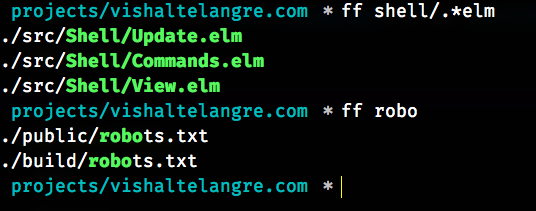

# Find Files (ff)

[](https://travis-ci.org/vishaltelangre/ff)
[](https://crates.io/crates/find-files)

Find Files (ff) utility recursively searches the files whose names match the
specified RegExp pattern in the provided directory (defaults to the current
directory if not provided).

Dual-licensed under [MIT](LICENSE-MIT) or the [UNLICENSE](UNLICENSE).

## Screenshot



## Installation

Download the latest precompiled executable `ff` binary for your platform from the [releases](https://github.com/vishaltelangre/ff/releases) page.

If you're a Rust programmer, download and install `ff` command using `cargo install find-files`. To update to a newer version, use the `--force` flag.

# Benchmark Results

```
$ hyperfine                                \
    --warmup 3                             \
    --export-markdown benchmark-results.md \
    "find . -iregex '.*[0-9]\.jpg$'"       \
    "find . -iname '*[0-9].jpg'"           \
    "fd -HI '.*[0-9]\.jpg$'"               \
    "ff .*[0-9]\.jpg$"

Benchmark #1: find . -iregex '.*[0-9]\.jpg$'
  Time (mean ± σ):      42.8 ms ±   5.5 ms    [User: 11.7 ms, System: 30.1 ms]
  Range (min … max):    31.2 ms …  56.9 ms    48 runs

Benchmark #2: find . -iname '*[0-9].jpg'
  Time (mean ± σ):      60.8 ms ±   7.2 ms    [User: 27.9 ms, System: 31.4 ms]
  Range (min … max):    44.0 ms …  76.2 ms    37 runs

Benchmark #3: fd -HI '.*[0-9]\.jpg$'
  Time (mean ± σ):      18.8 ms ±   5.3 ms    [User: 14.9 ms, System: 19.9 ms]
  Range (min … max):    11.2 ms …  41.6 ms    96 runs

Benchmark #4: ff .*[0-9]\.jpg$
  Time (mean ± σ):      18.7 ms ±   4.6 ms    [User: 15.7 ms, System: 22.5 ms]
  Range (min … max):    11.7 ms …  30.4 ms    123 runs

Summary
  'ff .*[0-9]\.jpg$' ran
    1.00 ± 0.37 times faster than 'fd -HI '.*[0-9]\.jpg$''
    2.29 ± 0.63 times faster than 'find . -iregex '.*[0-9]\.jpg$''
    3.25 ± 0.88 times faster than 'find . -iname '*[0-9].jpg'
```

| Command                          |  Mean [ms] | Min…Max [ms] |
| :------------------------------- | ---------: | -----------: |
| `find . -iregex '.*[0-9]\.jpg$'` | 42.8 ± 5.5 |    31.2…56.9 |
| `find . -iname '*[0-9].jpg'`     | 60.8 ± 7.2 |    44.0…76.2 |
| `fd -HI '.*[0-9]\.jpg$'`         | 18.8 ± 5.3 |    11.2…41.6 |
| `ff .*[0-9]\.jpg$`               | 18.7 ± 4.6 |    11.7…30.4 |

Table: *benchmark-results.md*

**NOTE:** Sometimes, `fd` is a bit faster than `ff` by approximately `1 ms` to `2 ms`.

## Usage

```
USAGE:
    ff [FLAGS] [OPTIONS] <PATTERN> [ROOT_PATH]

FLAGS:
    -s, --case-sensitive       Search case sensitively. By default, files are
                               searched case insensitively.
    -D, --exclude-dir-paths    Exclude paths from the search result which are
                               directories and not files.
    -h, --help                 Prints help information
    -G, --ignore-gitignore     Ignore searching files and directories specified
                               in .gitignore. By default, the files and
                               directories specified in .gitignore are included
                               in the search results.
    -H, --ignore-hidden        Ignore searching hidden files and directories. By
                               default, hidden files and directories are
                               included in the search results.
    -V, --version              Prints version information

OPTIONS:
    -x, --exclude <exclude>    Exclude files and directories matching this
                               regular expression from the search results.
    -j, --threads <threads>    The approximate number of threads to use. A value
                               of 0 (which is the default) results in thread
                               count set to available CPU cores.

ARGS:
    <PATTERN>      Find files whose name (path) matches this substring or
                   the regular expression.
    <ROOT_PATH>    Path to the directory to search files inside.[default:
                   `$PWD`]
```
## Examples

There are a tons of possibilities to search files using `ff`.
Following examples demonstrate just a tip of an iceberg.

- List paths of files recursively in the current working directory matching `article` string.

```
ff article
```

- List files having `.png`, or `.PNG` extension.

```
ff png$
```

- List files having strict `.PNG` extension.

```
ff -s PNG$
```

- Search various image files.

```
ff "\.(png|jpg|jpeg|gif|svg)$"
```

- List files whose path matches `controllers` string.

```
ff controllers
```

- Search `.js` files in `./spec` directory.

```
ff \.js ./spec
```

- Search a file which is expected to be inside hidden `.git` directory whose name contains `commit` or something similar.

```bash
$ ff git.*commit

./.git/COMMIT_EDITMSG
# omitted other results
```

- Do not show hidden files and directories in the search results.

```
ff something -H
```

- Do not show those files and directories in the search results which are enlisted in `.gitignore`.

```
ff src/.*js$ -G
```

Without `-G (--ignore-gitignore)` flag in the above command, it also includes the results in the directories such as `node_modules` by default.

- Do not show paths which are just directories and not actual files.

```bash
$ ff -D user

./app/models/user.rb
./app/models/user/address.rb
./specs/models/user_spec.rb
./specs/models/user/address_spec.rb
```

Without `-D (--exclude-dir-paths)` flag in the above command, it also includes the paths of the matching directories in the results as follows.

```bash
$ ff user

./app/models/user.rb
./app/models/user
./app/models/user/address.rb
./specs/models/user_spec.rb
./specs/models/user
./specs/models/user/address_spec.rb
```

- Exclude (omit) files and directories which match the provided optional exclude RegExp pattern.

```
ff rb$ app/controllers -x /(audit|admin|sso|api)/
```

Above command will show paths of all files whose name ends with `rb` inside the relative `app/controllers` directory excluding the paths which match `/(audit|admin|sso|api)/` pattern.
